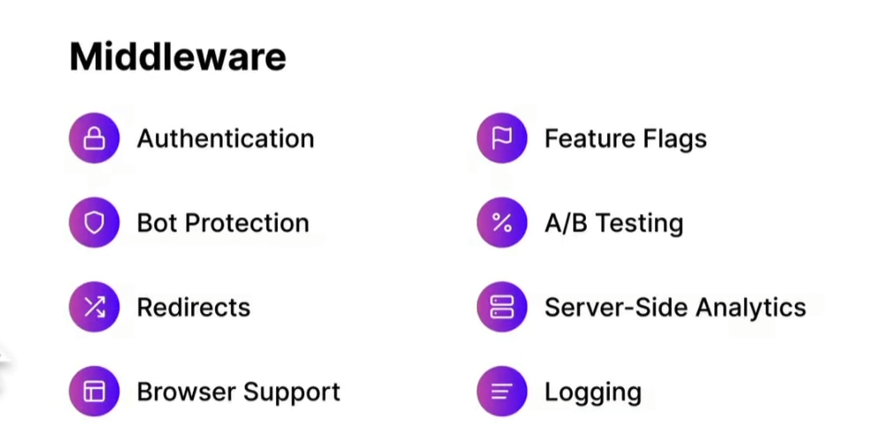

## Hvorfor findes next.js

Next.js er et framework der er bygget oppe foran react, giver dig mulighed for at bygge scalable apps.

Det gør det muligt at render content på serveren.
Next.js er fremtiden af react apps.
Next.js er kendt som et framework, for produktion.

I react render man altid content hos en client, men pga next.js er det muligt at ligge det på serveren. Dette gør din app meget mere fleksibel.

### Fordele ved next js

#### Forskellige render teknikker.

**Statisk side**
SEO, Post, Products
**Server side**
Netlix, dynamic news feed
**Incremental site**
Man får statisk side og server side i en pakke, ikke helt sikker på hvordan dette her virker. men det er vel også derfor jeg prøver at lære mere om det.

#### Performance

Man skal ikke tænke meget på performance, når man bygger i next.js, dette får man gratis, hvis man bruger framework rigtig.

**Hvilke fordele giver next.js angående performances**
**Code Splitting**
kun henter de filler, den valgte side skal bruge, det sker af sig selv.

<figure></figure>

**Minifying files**
Fjerner alt det der ikke er vigtigt.
Webpack er stadig vigtig at lære, men det meste sker nu af sig selv.

**Images optimization**
Vi kommer til at bruge et img component, også ud efter hvilke størrelse browseren er i. bliver billede lavet mindre eller støre automatisk.

**Pre-fetching assets**
Henter kun data der skal bruges, hvis brugeren scroller længer ned, vil serveren hente mere data og automatisk loade det ind. når daten kommer ind i view port.

**stor telefon**

<figure></figure>

**lille telefon**

<figure></figure>

### File base Routing

I next.js kommer der automatisk pages, og jeg har ikke brug for at installer andre packets, som også ses på dette billede.

<figure></figure>

Det hjælper også på performance pga dette. Derfor skal jeg ikke sætte noget op for at det skal virke, så længe at jeg bruger deres pages struktur.

## hvike problemer løser det?

#### Godt for SEO

<figure></figure>

Next.js gør det muligt at opdater titel og meta beskrivelse på alle dine sider og se hvad en bot ser.

### Serverless Funktions

<figure></figure>

Den automatisk laver en node server der køre din api, sådan at du let kan dele data mellem din frontend og din backend.
I din backend kontakter vi de forskellige api'er og dette gør at brugeren ikke kan få lov at se hvilken api'er der er tilgængelig for brugeren.

Serverless køre kun når der er noget der skal bruges, sådan at jeg skal køre en server, hvis den ikke skal bruges.

## Hvorfor er next.js så populært?

Du kan allerede se en masse grunde til hvorfor next.js er så smart og populært. Her slipper jeg for en del arbejde, når man arbejder med react app.
Man har mulighed for at bygge den bedste performance app man kan, hvis bruger next.js.

### Skal man altid bruge next.js

Hvis du har en meget lille opgave, vil det være fint ikke at arbejde med next.js. Hvis man har brug for at vælger mellem server side og clint side kan det være en god ide at bruge next.js.

Hvis dette ikke er nødvendigt, er der ikke den store grund til at bruge next.js.

## Opdater Pacpage

Her kan man finde data om hvordan man opdater sine package, sådan at man får alle fordelene ved den nyeste version.
har fuldt denne guide til at gøre det.

<a href="https://nextjs.org/docs/upgrading" >Upgrade guide </a>

## Features of Next.js 12

En af de førte ting de har fået er rust compiler, dette gør next mange gange hurtigere.
Det vi brugte før var babel, men nu gør vi brug af rust.

## Middleware

Det er noget der sidder i midden :) ej det er rigtig nok, det sidder i mellem vores user og vores api.
Her nede under kan du se nogle af fordelene middleware kan tilbyde.

<figure></figure>

**Her er også nogle andre fordele middleware tilbyder.**

- Authentication
- Bot protection
- Redirects and rewrites
- Handling unsupported browsers
- Feature flags and A/B tests
- Server-side analytics
- Advanced i18n routing requirements
- Logging
- And more!

### Du kan selv vælge hvornår du bruger det.

Her er et eksempel på hvordan man kan bruge det.

```js
// pages/_middleware.js

export function middleware(req, ev) {
  return new Response("Hello, world!");
}
```

Normalt tager det en del setup for at sætte op, men det dejlige er at next.js klare alle de her ting for en.

## De gør sig klar til at arbejde med react 18

React 18 er i beta når jeg laver dette projekt, men med next.js gør at der højest sandsynlig ikke kommer de store breaking changes.

Det gør det også muligt at imponerer package direkte gennem en url, sådan at du lynhurtig kan teste med en anden package.

```js
module.exports = {
  experimental: {
    urlImports: ["https://cdn.skypack.dev"],
  },
};
```

Sådan at du kan hente package sådan her.

```js
import confetti from "https://cdn.skypack.dev/canvas-confetti";
```

### BOT Aware ISR Fallback

Her bliver det muligt at lave server render, hvis fx `Gooogle` kommer forbi og skal teste vores side, her prøver vi at spare så meget som muligt. Her viser vi fx ikke en loader, Selv om dette gør det mere brugervenligt for bruger, men en bot har intet forhold til dette og gør kun vores side langsommere.

Dette komme til at gøre ens SEO en del bedre.

### Nok en af de bedste ting i version 12 er Edge Functions (BETA)

Hvis man bruger Vercel som cloud provider, så er edge function rigtig sejt.
Når jeg pusher noget kode, skulle det hele gerne virke ud af boksen.

Den skulle gerne sætte det op til en `CDN` som der vil optimer din load speed og gøre vores respond en del hurtigere.

Edge function arbejde rigtig tæt sammen med middleware. Det vil sige at hvis jeg har lavet noget middleware, vil det automatisk blive sat op.

Dette var nogle af de vigtig ting der er kommet med i next.js 12.
