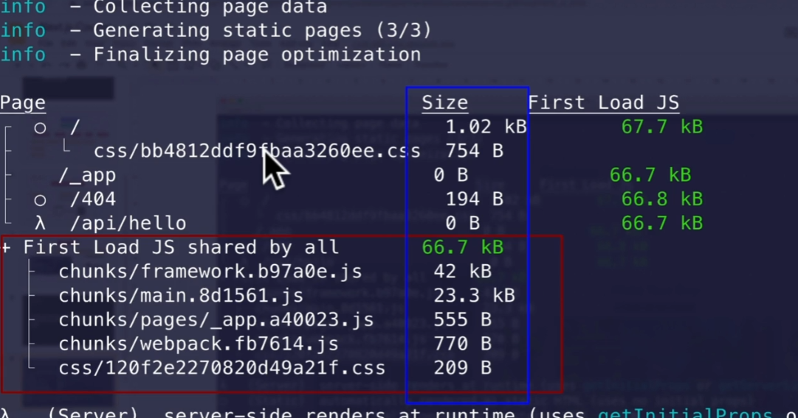
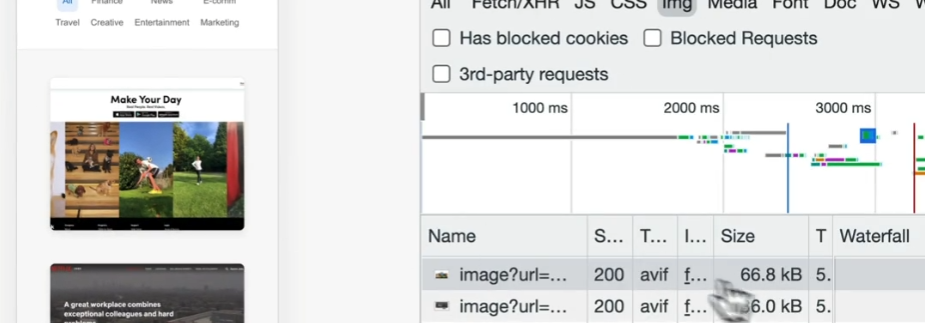
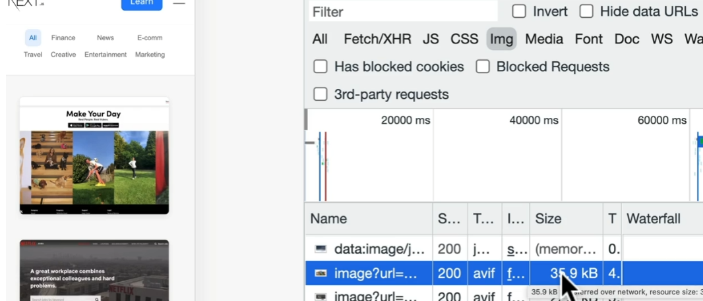
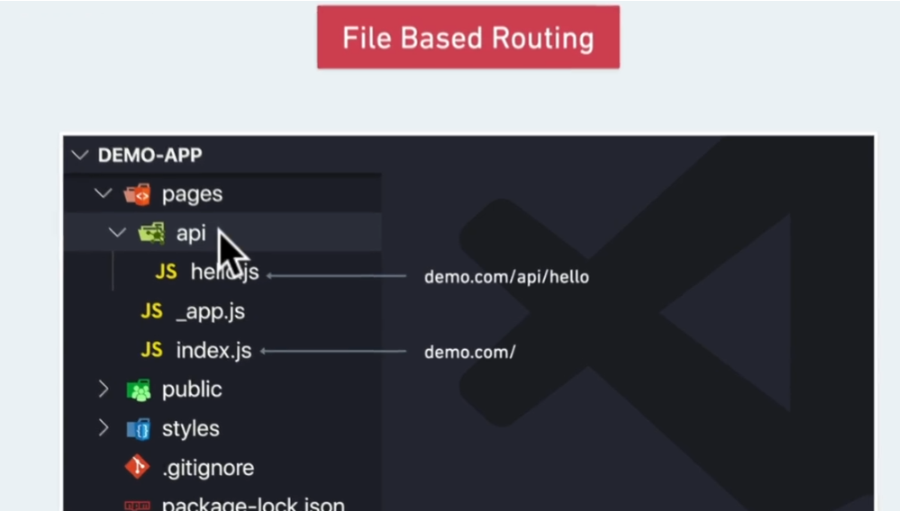
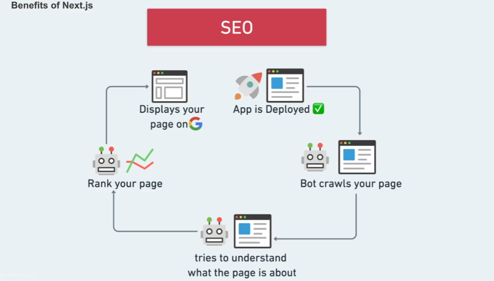
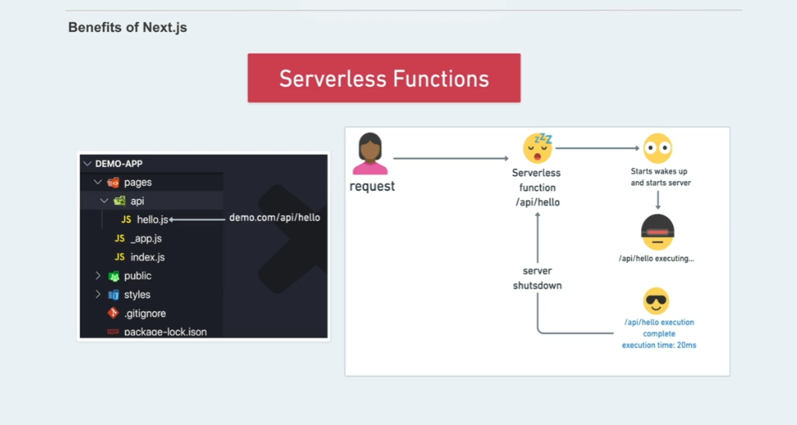

## Hvorfor findes next.js

Next.js er et framework der er bygget oppe foran react, giver dig mulighed for at bygge scalabel apps.

Det gør det muligt at render content på serveren.
Next.js er fremtiden af react apps.
Next.js er kendt som et fremwork, for produktion.

I react render man altid content hos en client, men pga next.js er det muligt at ligge det på serveren. Dette gør din app meget mere flexsibel.

### Fordelle ved next js

#### Forsekellig render teknikger.

**Statick side**
SEO, Post, Products
**Server side**
Netlix, dynamic news feed
**Incremental site**
Man får statisk side og server side i en pakke, ikke helt sikker på hvordan dette her virker. men det er vel også derfor jeg prøver at lære mere om det.

#### Performance

Man skal ikke tænke meget på performance, når man bygger i next.js, dette får man gratis, hvis man bruger fremworket rigtig.

**Hvilke fordele giver next.js andgående preformance**
**Code Splitting**
kun henter de filler, den valgte side skal bruge, det sker af sig selv.

<figure></figure>

**Minifying files**
Fjerner alt det der ikke er vigtigt.
Webpack er stadig vigtig at lære, men det meste sker nu af sig selv.

**Images optimization**
Vi kommer til at bruge et img compuntent, også ud efter hvilke størelse browseren er i. bliver billede lavet mindre eller støre automatisk.

**Pre-fetching assets**
Henter kun data der skal bruges, hvis brugeren scroller længer ned, vil serverern hente mere data og automatisk loade det ind. når dataen kommer ind i view port.

**stor telefon**

<figure></figure>

**lille telefon**

<figure></figure>

### File base Routing

I next.js kommer der automatisk pages, og jeg har ikke brug for at installer andre packets, som også ses på dette billede.

<figure></figure>

Det hjælper også på preformace pga dette. Derfor skal jeg ikke sætte noget op for at det skal virke, så længe at jeg bruger deres pages strugtur.

## hvike problemer løser det?

#### Godt for SEO

<figure></figure>

Next.js gør det muligt at opdater titel og meta beskrivelsse på alle dine sider og se hvad en bot ser.

### Serverless Funktions

<figure></figure>

Den automatisk laver en node server der køre din api, sådan at du let kan dele data mellem din frotend og din backend.

I din backend kontakter vi de forskellige api'er og dette gør at brugeren ikke kan få lov at se hvike api'er der er tilgængelig for brugeren.

Serverless køre kun når der er noget der skal bruges, sådan at jeg skal køre en server, hvis den ikke skal bruges.

## Hvorfor er next.js så populært?

Du kan allerade se en masse grunde til hvorfor next.js er så smart og populært. Her slipper jeg for en del arbejde, når man arbejder med react app.

Man har mulighed for at bygge den bedste preformenc app man kan, hvis bruger next.js.

### Skal man altid bruge next.js

Hvis du har en meget lille opgave, vil det være fint ikke at arbejde med next.js. Hvis man har brug for at vælger mellem server side og clint side kan det være en god ide at bruge next.js.

Hvis dette ikke er nødvendigt, er der ikke den store grund til at bruge next.js.
